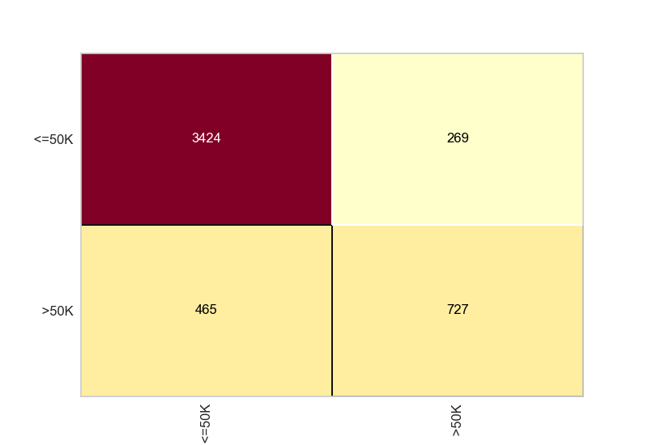

# 🔍 Análise de Modelos com Regressão Logística


Projeto de classificação com **Regressão Logística**, aplicando o modelo em três conjuntos de dados distintos: `risco_credito`, `credit`, e `census`. As métricas de avaliação e as visualizações permitem compreender a performance do modelo em diferentes contextos.

## 📁 Bases de Dados

- `risco_credito.pkl`  
- `credit.pkl`  
- `census.pkl`  

Todas as bases foram serializadas com `pickle`.

---

## 🛠️ Ferramentas Utilizadas

- `Python`
- `Scikit-learn`
- `Yellowbrick`
- `Matplotlib`
- `Pandas / Numpy`

---

## 🔍 Fluxo do Projeto

1. **Importação dos dados** com `pickle`
2. **Pré-processamento** (remoção de instâncias específicas na base de risco)
3. **Treinamento** dos modelos com `LogisticRegression`
4. **Geração de previsões**
5. **Avaliação** com:
   - Acurácia
   - Relatório de Classificação
   - Matriz de Confusão Visual com `Yellowbrick`

---

## 📊 Avaliação

Para cada dataset, os seguintes indicadores são apresentados:

### Dataset 'credit.pkl'

 **Acurácia:** [`0.946`]
 **Matriz de Confusão:**
  

**classification_report**

                precision   recall   f1-score   support

           0       0.97      0.97      0.97       436
           1       0.79      0.78      0.79        64

    accuracy                           0.95       500
   macro avg       0.88      0.88      0.88       500
weighted avg       0.95      0.95      0.95       500
  

### Dataset 'census.pkl'

 **Acurácia:** [`0.849`]
 **Matriz de Confusão:**
  
  
  **classification_report**

                precision    recall  f1-score   support

       <=50K       0.88      0.93      0.90      3693
        >50K       0.73      0.61      0.66      1192

    accuracy                           0.85      4885
   macro avg       0.81      0.77      0.78      4885
weighted avg       0.84      0.85      0.84      4885
---

## 🚀 Execução

Certifique-se de ter os arquivos `.pkl` no mesmo diretório e execute os notebooks ou scripts Python.

```bash
pip install -r requirements.txt
python seu_script.py

--- 

## 👨‍💻 Quem Desenvolveu

Projeto desenvolvido por:

**Daniel Campos Coelho**  
🎓 Estudante de Ciências da Computação  
🔗 [LinkedIn](https://www.linkedin.com/in/daniel-coelho-818381293/)  
💻 [GitHub](https://github.com/daccoelho)

---

## ✨ Contribuições

Contribuições são muito bem-vindas! Sinta-se à vontade para fazer um fork, abrir uma issue ou mandar um pull request.

---